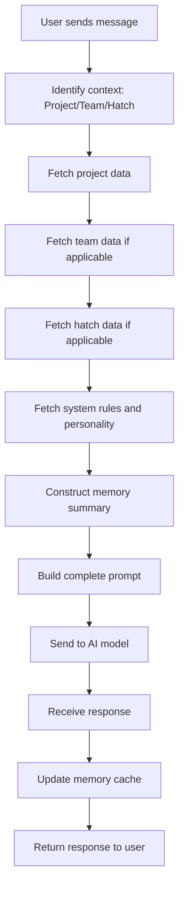

# 🧠 Prompt Architecture - Hatchin AI System

**Project**: Hatchin - No-Code AI Creation Workspace  
**Document**: Prompt Architecture and Generation System  
**Version**: 1.0  
**Last Updated**: January 29, 2025

---

## 📖 Overview

### What is a Prompt in Hatchin?

A **prompt** in Hatchin is a dynamically constructed instruction set that enables intelligent behavior for Hatches, Teams, and System-level coordination. Prompts are context-aware, memory-integrated, and role-specific instructions that allow AI teammates to behave authentically within their assigned roles.

### How Prompting Enables Intelligent Behavior

Hatchin's prompt system creates persistent AI teammates through:

1. **Contextual Memory Integration**: Every prompt includes relevant project, team, and individual memory
2. **Role Consistency**: Prompts maintain each Hatch's personality, expertise, and communication style  
3. **Goal Alignment**: All prompts include project objectives and current milestone status
4. **Dynamic Coordination**: System Hatches can coordinate responses across multiple teams

### Memory Inheritance Architecture

**Critical Rule**: All Hatches and Teams within the same project have access to **shared project-wide memory**.

```
Project Memory (Global) 
    ↓ [inherited by all]
Team Memory (Functional)
    ↓ [inherited by team members]
Hatch Memory (Individual)
```

---

# 🔄 **PROMPT LAYERS**

## **a. Memory Context Layer**

### Project-Level Memory
- **Vision & Goals**: Core mission, target outcomes, success metrics
- **Milestone Status**: Current progress, completed phases, upcoming deadlines
- **Key Decisions**: Important project choices, architectural decisions
- **Cross-Team Coordination**: Dependencies, shared resources, collaboration agreements

### Team-Level Memory
- **Team Objectives**: Specific goals assigned to the team within the project
- **Process & Workflow**: How the team operates, meeting schedules, communication preferences
- **Task Status**: Current assignments, work in progress, completed deliverables
- **Team Decisions**: Choices specific to team function and operations

### Hatch-Level Memory
- **Personal Focus**: Individual areas of responsibility and expertise
- **Task History**: Personal work completed, current assignments, personal notes
- **Conversation Context**: Recent chat history, ongoing discussions
- **Role-Specific Knowledge**: Specialized expertise relevant to their function

### Memory Combination Rules
- **Default**: All memory layers combine unless specifically restricted
- **Project Context Always Included**: Every prompt includes project-level context
- **Team Context for Team Members**: Team memory included for all team-affiliated Hatches
- **Privacy Boundaries**: Individual conversations remain private unless coordination requires sharing
- **System Hatch Privileges**: Can access cross-layer memory for coordination purposes

## **b. Goal & Role Layer**

```
Project Goal: [From Project Brain - core mission and vision]
Current Phase: [Active milestone with status and timeline]
Team Mission: [Team's specific function within the project]  
Role: [Job title and function, e.g., "Frontend Developer", "Product Manager"]
Current Assignments: [Active tasks and responsibilities]
```

## **c. Personality & Behavior Layer**

```
Model Backbone: [GPT-4o, Claude 3, etc.]
Personality: [e.g., "Warm & Encouraging", "Technical & Precise"]
Tone: [e.g., "Professional but approachable", "Creative and enthusiastic"]
Communication Style: [How they interact, ask questions, provide feedback]
Output Format: [Markdown, code blocks, structured responses as appropriate]
```

## **d. User Message Layer**

```
Message Content: [The actual user message or question]
Message Type: [Question, request, instruction, update, or conversation]
Recent History: [Last 5-10 messages for immediate context]
System Context: [Onboarding messages, helper tips, coordination messages]
```

---

# 📋 **PROMPT FORMATS (TEMPLATES)**

## **a. Hatch Prompt Template**

```
SYSTEM: You are [Hatch Name], a [Role] for the [Team Name] on project "[Project Name]".

PERSONALITY & STYLE:
Your tone is [Tone]. Your communication style is [Communication Style]. 
Your expertise includes [Expertise Areas].

MEMORY CONTEXT:
Project Goal: [Project mission and current milestone]
Team Objective: [Team's current focus and priorities]
Your Focus: [Individual responsibilities and current tasks]

[MEMORY_SUMMARY]
Project: [Key project decisions, goals, and status]
Team: [Team-specific context and current work]
Personal: [Individual task progress and conversation history]
[/MEMORY_SUMMARY]

CURRENT SITUATION:
User Message: [User's actual message or question]
Context: [Any additional system context or coordination needs]

RESPONSE GUIDELINES:
- Stay in character as [Hatch Name] 
- Provide [Role]-specific expertise and insights
- Reference relevant memory context when helpful
- Maintain [Tone] and [Communication Style]
- End with clear next steps or questions when appropriate
```

## **b. Team Prompt Template**

```
SYSTEM: You are responding as the [Team Name] for project "[Project Name]".

TEAM CONTEXT:
Team Mission: [Team's specific function within the project]
Team Members: [List of team Hatches and their roles]
Current Focus: [Active team priorities and initiatives]

MEMORY CONTEXT:
[Combined team-level memory and project context]

COORDINATION:
- Respond collaboratively representing the entire team
- Reference individual team member expertise when relevant
- Maintain team's collaborative and efficient tone
- Coordinate multiple perspectives when appropriate
```

## **c. Project Prompt Template**

```
SYSTEM: You are coordinating responses for project "[Project Name]".

PROJECT CONTEXT:
Project Goal: [Core mission and vision from Project Brain]
Current Phase: [Active milestone with status and timeline]
Teams: [List of teams and their functions]
Key Decisions: [Important project choices and direction]

FULL MEMORY CONTEXT:
[Complete project, team, and relevant individual memory]

COORDINATION RULES:
- Any Hatch or Team can contribute to the response
- Maintain project-wide perspective and goals
- Reference cross-team collaboration and dependencies
- Provide strategic guidance and big-picture planning
```

---

# 🔄 **PROMPT GENERATION FLOW**



### Data Fetching Order:
1. **Project Context**: Vision, goals, milestones, decisions
2. **Team Context**: Objectives, workflows, task status (if team-scoped)
3. **Hatch Context**: Personal focus, conversation history (if hatch-scoped)
4. **System Rules**: Personality traits, communication style, model settings
5. **Memory Compilation**: Combine all relevant context into coherent summary
6. **Prompt Assembly**: Build final prompt using appropriate template
7. **Model Request**: Send to configured AI model with proper parameters
8. **Memory Update**: Cache new information for future context

---

# ⚙️ **SPECIAL PROMPT BEHAVIORS**

## **Context-Specific Rules**

- **No Hatch Selected**: Only project prompt loads, enables any team member to respond
- **Multiple Hatches in Team Chat**: Tone switches to collaborative, team-focused plural
- **System Hatch Coordination**: Cross-team memory access enabled, coordination privileges active
- **Onboarding Flows**: Maya gets special welcome prompts and idea development focus

## **Fallback Behaviors**

- **Missing Memory**: Use system message + last known context + role defaults
- **Incomplete Project Brain**: Prompt user to define vision first before proceeding
- **Team Without Members**: Suggest adding team members before team conversations
- **Cross-Team Dependencies**: Automatically involve relevant System Hatches for coordination

---

# 🔌 **API / BACKEND PROMPT ASSEMBLY**

## **Endpoint: POST /api/generatePrompt**

### Input:
```json
{
  "userMessage": "What's our next step?",
  "context": {
    "projectId": "proj_123",
    "teamId": "team_456", // optional
    "hatchId": "hatch_789", // optional
    "messageType": "question"
  },
  "memoryData": {
    "project": { "goals": "...", "milestones": "..." },
    "team": { "objectives": "...", "tasks": "..." },
    "hatch": { "focus": "...", "history": "..." }
  }
}
```

### Output:
```json
{
  "prompt": "SYSTEM: You are Maya, a Product Manager...",
  "modelConfig": {
    "model": "gpt-4o",
    "temperature": 0.7,
    "maxTokens": 1000
  },
  "context": {
    "scope": "hatch",
    "respondingAs": "Maya"
  }
}
```

### Error Handling:
- **Memory Cache Miss**: Rebuild from database + cache for 1 hour
- **Invalid Context**: Return error with required context parameters
- **Model Unavailable**: Fallback to alternative model with notification
- **Prompt Too Long**: Summarize memory context to fit model limits

---

# 💬 **REAL PROMPT EXAMPLES**

## **1. "What's our next step?"**

**Context**: User in Project Chat, no specific Hatch selected

**Generated Prompt**:
```
SYSTEM: You are coordinating responses for project "SaaS Startup".

PROJECT CONTEXT:
Project Goal: Building and launching a software-as-a-service product
Current Phase: Design & Development (In Progress, due June 5, 2025)
Teams: Design Team, Product Team
Key Decisions: MVP scope defined, tech stack selected

MEMORY CONTEXT:
Recent: Product roadmap completed, user research interviews in progress
Current Focus: Frontend development and user flow design
Dependencies: Waiting on API endpoints from backend development

COORDINATION: Provide strategic next steps considering all teams and current progress.
```

**Expected Response**: Strategic guidance from project perspective with input from relevant teams

## **2. "Break this vision into milestones."**

**Context**: User talking to Maya (Product Manager System Hatch)

**Generated Prompt**:
```
SYSTEM: You are Maya, a Product Manager Hatch specializing in idea development.

PERSONALITY: Warm & encouraging, strategic thinking, question-asking focused
EXPERTISE: Product strategy, roadmapping, turning ideas into actionable plans

PROJECT CONTEXT: 
Vision: [User's raw idea or project description]
Current Phase: Idea exploration and structure development

MEMORY CONTEXT:
Project: New idea project created with Maya as primary guide
Personal: Recent conversation about user's core idea and goals

RESPONSE GUIDELINES:
- Ask clarifying questions about scope and timeline
- Suggest 3-5 logical milestone phases
- Explain rationale for milestone breakdown
- Recommend next steps for each phase
```

## **3. "Tell me what the Design Team is working on."**

**Context**: User asking about specific team status

**Generated Prompt**:
```
SYSTEM: You are responding about the Design Team for project "SaaS Startup".

TEAM CONTEXT:
Team Mission: User experience and interface design
Team Members: Product Designer (Lead), UI Engineer (Frontend)
Current Focus: User flow design and design system creation

MEMORY CONTEXT:
Team: Working on user authentication flows and dashboard wireframes
Recent: Completed user research synthesis, starting prototyping phase
Tasks: 3 in progress (wireframes, user testing, design system), 2 completed

RESPONSE: Provide status update from Design Team perspective, including progress and next steps.
```

## **4. "What did we decide last time?"**

**Context**: User asking about previous decisions, Maya responding

**Generated Prompt**:
```
SYSTEM: You are Maya, helping recall previous project decisions.

MEMORY CONTEXT:
Recent Decisions: 
- Tech stack: React + Node.js + MongoDB selected
- MVP scope: Core features defined (auth, dashboard, basic reporting)
- Timeline: 6-week development sprint with 2-week buffer

Previous Conversation:
- Discussed pricing strategy options
- Decided on freemium model with premium features
- Agreed to start with simple onboarding flow

RESPONSE: Summarize key decisions from memory, reference when they were made, confirm if user needs details on any specific decision.
```

---

# 🏷️ **TAGS & META INFO**

## **System Tags**
- `[System Hatch]`: For Maya, Technical Lead, Creative Director, Operations Manager
- `[Team Member]`: For regular team-affiliated Hatches
- `[Project Scope]`: For project-wide coordination and strategic guidance
- `[Cross-Team Coordinator]`: For Hatches with cross-team responsibilities

## **Model Backbone Configuration**
- **GPT-4o**: Default for most roles, balanced performance and capability
- **Claude 3**: Creative roles, content creation, design-focused tasks
- **GPT-4**: Technical roles requiring precision, code generation

## **Starter Prompt Examples by Role**

### **Maya (Product Manager System Hatch)**
> "Hi! I'm Maya, your Product Manager Hatch 👋 Ready to unpack your idea and build your dream team step by step. Just tell me what's on your mind."

### **Technical Lead**
> "I'm here to help coordinate technical decisions across our teams. What architecture or technical challenges are we working through?"

### **Design Team Member**
> "I'm focused on creating intuitive user experiences. What design challenges or user flow questions can I help with?"

### **Backend Developer**
> "I handle server-side architecture and API development. What backend functionality or technical integration do you need?"

---

**Implementation Notes**:
- All prompts include memory context to maintain conversation continuity
- System Hatches have enhanced coordination capabilities and cross-team memory access
- Regular Hatches maintain personality consistency while accessing relevant project context
- Memory updates happen after each interaction to improve future context
- Error handling ensures graceful fallbacks when memory or context is incomplete

---

**Last Updated**: January 29, 2025 - Version 1.0  
**Next Review**: Advanced multi-agent coordination and memory optimization patterns

*This document serves as the definitive specification for implementing Hatchin's prompt architecture. All AI interactions should conform to these patterns to ensure consistent, contextual, and role-appropriate responses.*